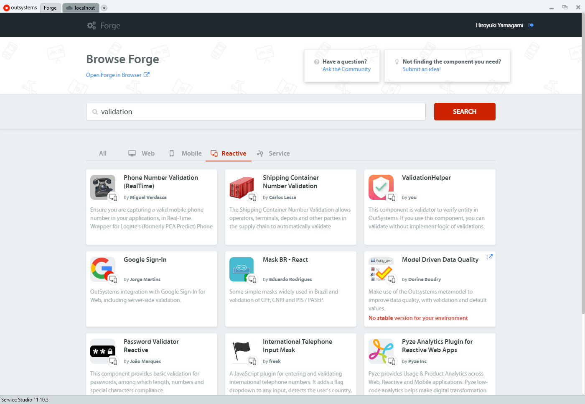
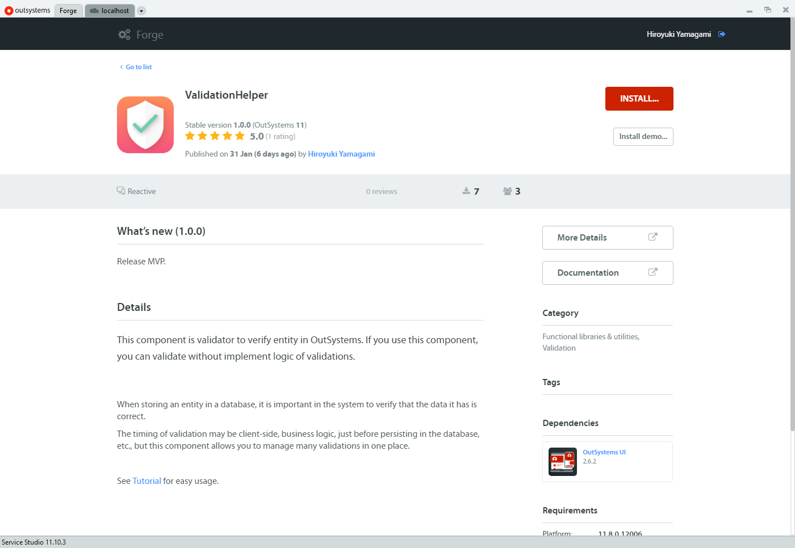
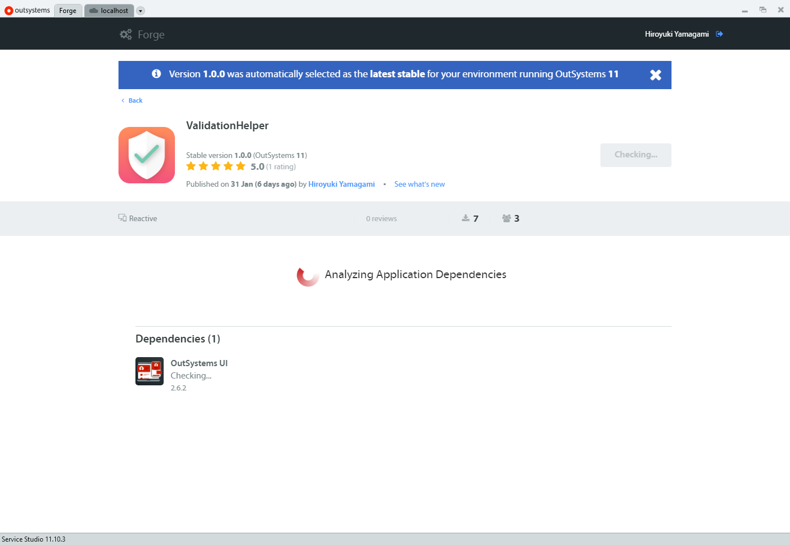
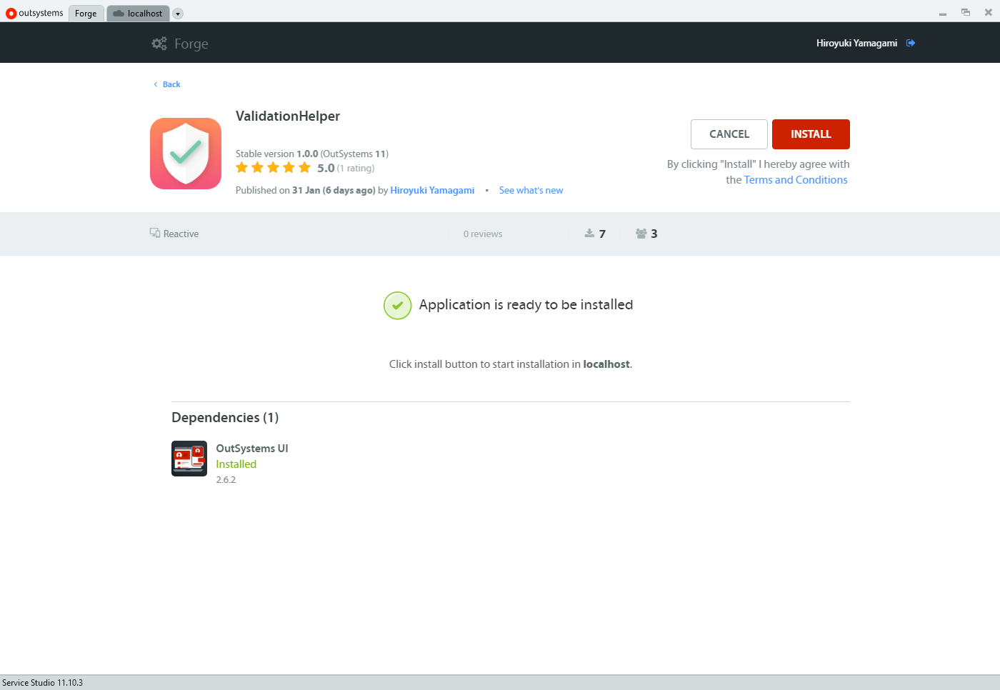
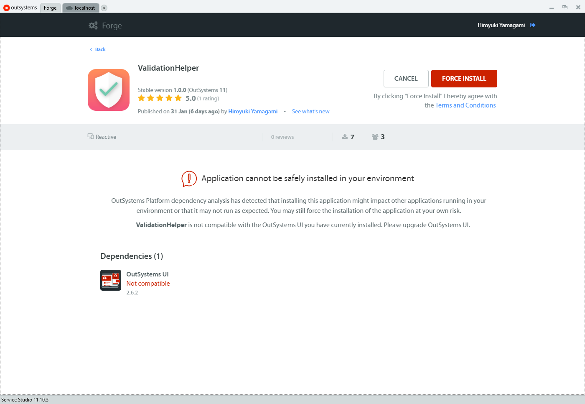

# Getting started

I will briefly explain how to use "ValidationHelper". There is nothing difficult. It's very easy.

## Installation

First of all, start ServiceStudio. Then open `Forge` from the tabs on the top left. Then enter `validation` to search. You will see it in the search results as follows:

{: loading=lazy }

When you open the details page of `ValidationHelper`, you should see an" Install "button. Let's click.

{: loading=lazy }

You may have to wait a few seconds to check for dependencies.

{: loading=lazy }

Click "Install" again and you're done.

{: loading=lazy }

If a warning appears on the screen, please read the notice carefully and deal with it.

{: loading=lazy }
