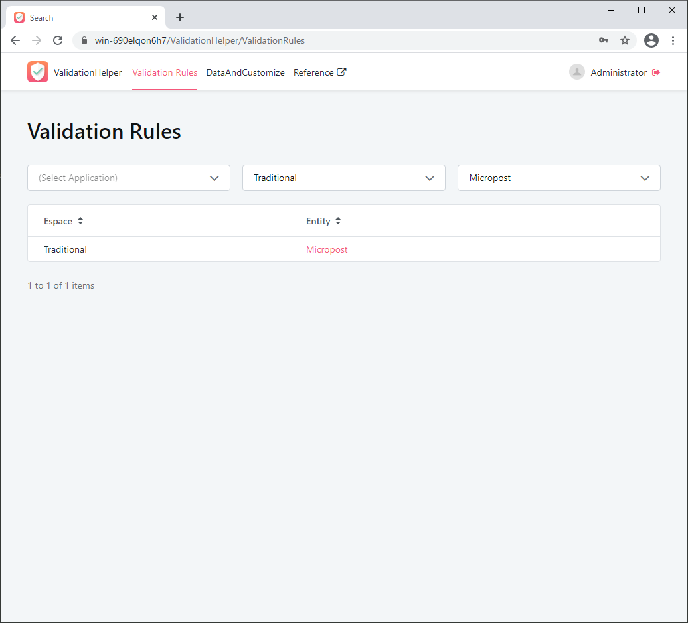
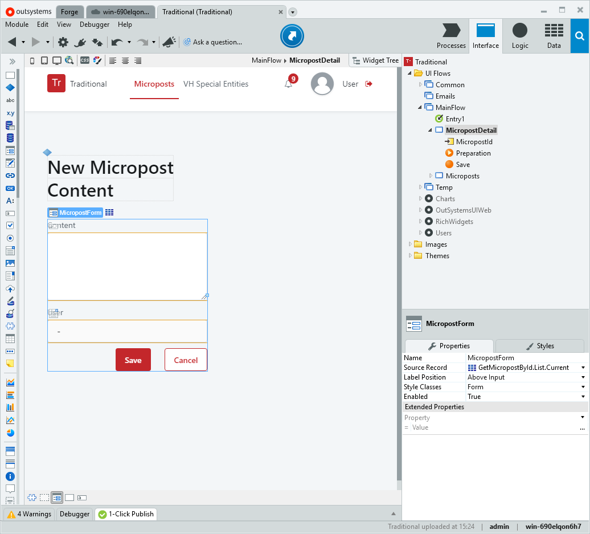

# Tutorial

There are two things to do.

1. Define validation rules in this app.
2. Call validation action where you want to verify.

For example, there is the following entity.

{: loading=lazy }

`Micropost` entity has three attributes.
`Id` attribute is identifier of this entity.
`Content` attribute has text that length is less than or equal to 140.
`UserId` attribute has `ServiceCenter/User.Id`.
All three attributes are mandatory.

I want to verify three things below.

1. `Content` has text that length 1~140.
2. User of `UserId` is exist.

Now let's get started.

## 1. Define validation rules in this app

Open the validation rules page in this app (https://<YOUR_SERVER\>/ValidationHelper/).
The page of `Micropost` is as follows.
You will see the attributes in `Micropost` and you will see a link to add validation.

{: loading=lazy }

Set the validation rules.

{: loading=lazy }

## 2. Call validation action where you want to verify

Open the screen I want to verify in Service Studio.
(The screen below was created by scaffolding.)

{: loading=lazy }

Open the action you want to validate. This time I will verify in the "Save" button.
Then call the validation action of "VH_IsValidEntity".
In the input parameter "EntityObject" of this action, specify the variable of the entity converted by "ToObject".

{: loading=lazy }

That's all for how to use it.
Let's check the execution result

## Execution Result

Open the details screen of "Micropost" and enter 141 characters in "Content". Nothing is specified for "UserId".

{: loading=lazy }

When I clicked the "Save" button, verification was performed and two errors occurred.

{: loading=lazy }

Now empty Content and click Save. It has been verified as expected.

{: loading=lazy }
