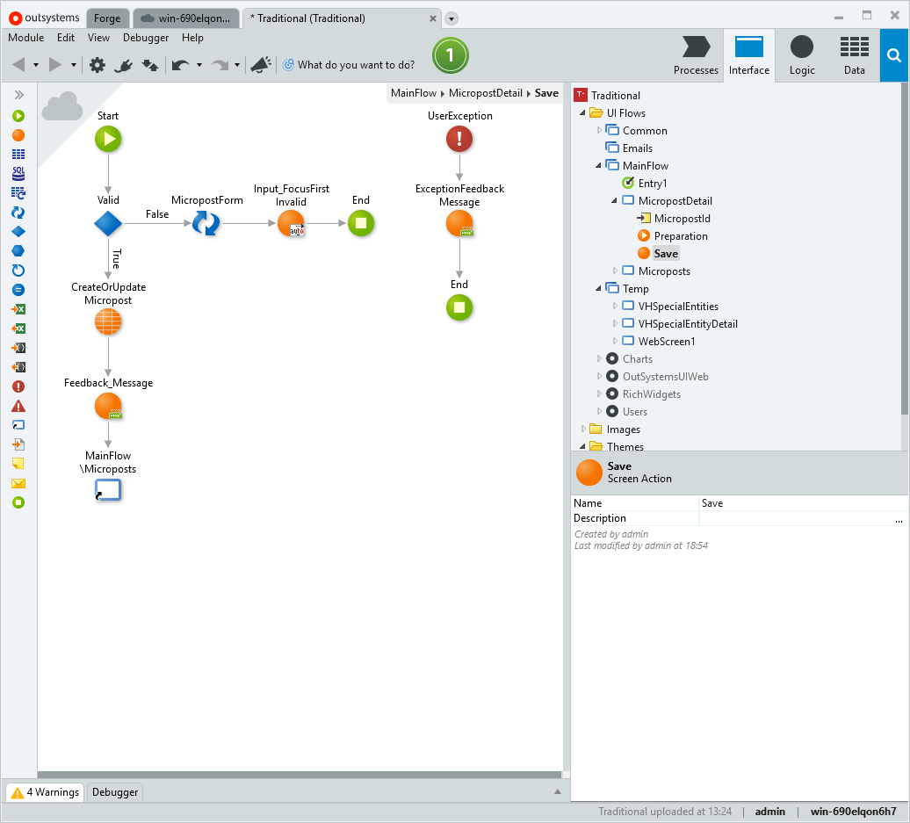
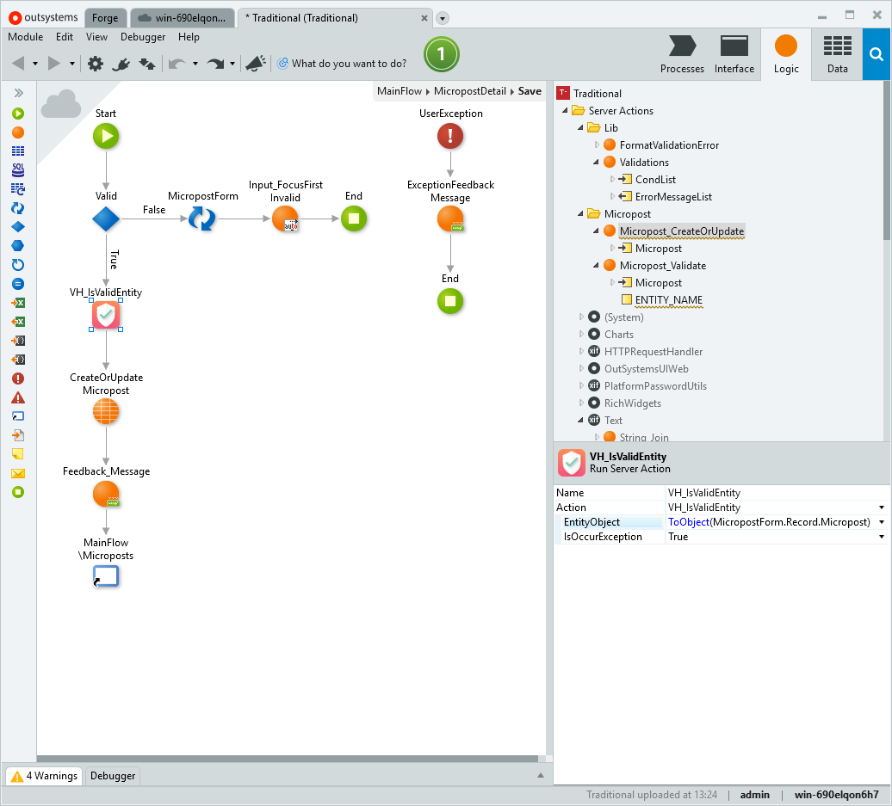
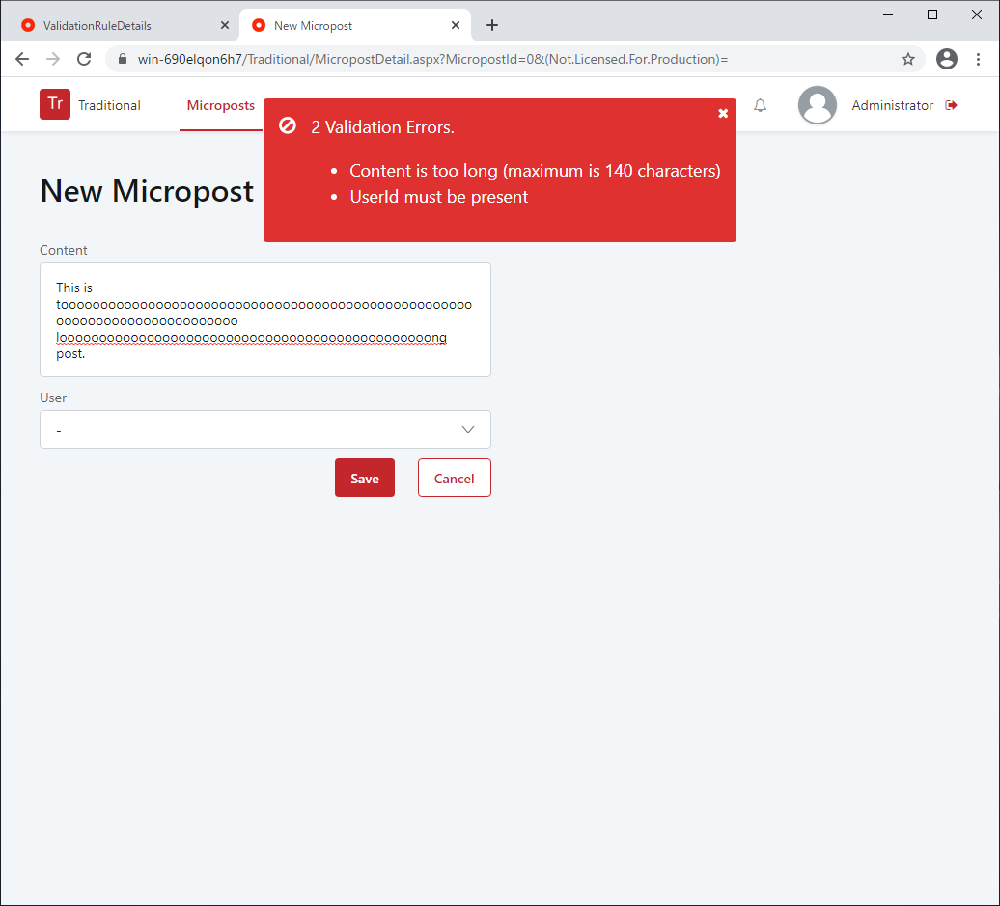

# Tutorial

Hello, Thank you for opening this page.  
This tutorial will show you how to use "ValidationHelper" through the simplest use case.

---

There are two things to do.

1. Define validation rules in this app.
2. Call validation action where you want to verify.

For example, there is the following entity.

{: loading=lazy }

`Micropost` entity has three attributes.
`Id` attribute is identifier of this entity.
`Content` attribute has text that length is less than or equal to 140.
`UserId` attribute has `ServiceCenter/User.Id`.
All three attributes are mandatory.

In validation, I would like to confirm the following two points.

1. `Content` has text that length 1~140.
2. User of `UserId` is exist.

Now let's get started.

## 1. Define validation rules in this app

First of all, open the ValidationHelper app (https://<YOUR_SERVER\>/ValidationHelper/).  
Then, the entity search screen is displayed, so search for the entity for which you want to set validation rules.

This time I want to define a validation rule for the "Micropost" entity, so search for "Micropost".

{: loading=lazy }

Open the details page for "Micropost" entity. This page shows the attributes that "Micropost" entity has and provides links to add a validation rule to each attribute.

{: loading=lazy }

I have set the validation rules as follows:

- **Content:** Min = 1, Max = 140
- **UserId:** Presence

{: loading=lazy }

## 2. Call validation action where you want to verify

Open the screen I want to verify in Service Studio.
(The screen below was created by scaffolding.)

{: loading=lazy }

Open the action you want to validate. This time I would like to validate with the `Save` button.
The processing of the `Save` button is as follows.

{: loading=lazy }

Validation must be done before saving to the database. So this time I will validate before `CreateOrUpdateMicropost`. "ValidationHelper" provides an action named `VH_IsValidEntity` for validation, so add this action before `CreateOrUpdateMicropost`.

{: loading=lazy }

Using `VH_IsValidEntity` is very easy and you specify two parameters.

**Parameter 1 :** `EntityObject`  
Specify the variable to be validated. The data type of the variable must be an entity. Variables also need to be converted to object types using the "ToObject" function. In this case, specify `ToObject (MicropostForm.Record.Micropost)`.

**Parameter 2 :** `IsOccurException`  
If you specify `True`, an exception will occur when validation fails. The exception that occurs here is caught by the handler in this screen action and a feedback message is displayed. The error message is formatted just right for display in a feedback message.

That's all for how to use it.  
Let's check the execution result.

## Execution Result

Open the details screen of "Micropost" and enter 141 characters in "Content". Nothing is specified for "UserId".

{: loading=lazy }

When I clicked the "Save" button, verification was performed and two errors occurred.

{: loading=lazy }

Now empty the content, set User to "Administrator" and click Save.  
It has been verified as expected.

{: loading=lazy }

---

That's all for the tutorial.  
There are other types of validation available with "ValidationHelper" besides those used in this tutorial. See [Reference](/Reference) for more information.

