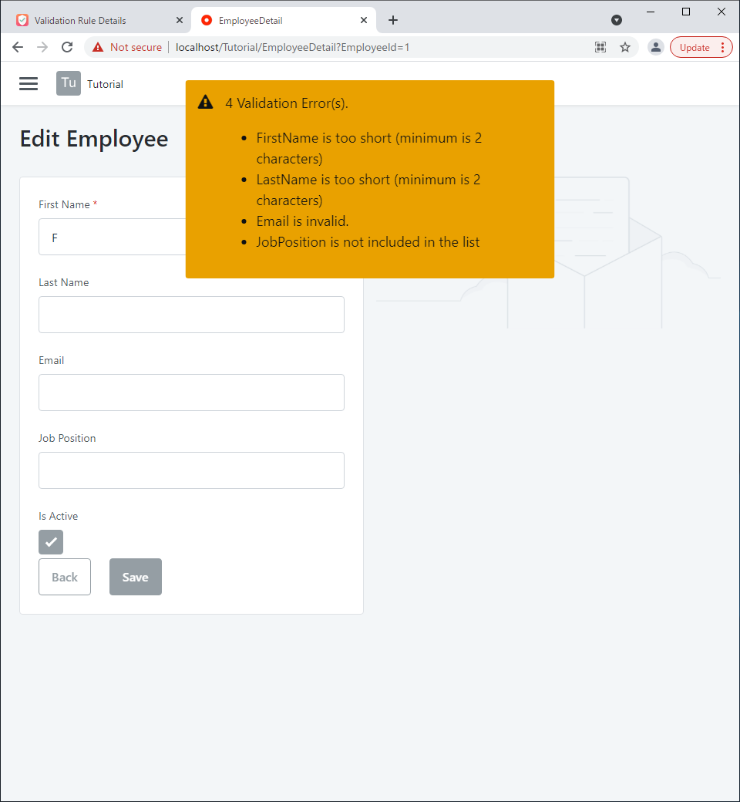

# Tutorial

Hello, Thank you for opening this page.  
This tutorial will show you how to use "ValidationHelper" through the simplest use case.

Tutorial Steps:

1. Create the app and entity for this tutorial
2. Define validation rules in this app.
3. Call verification action where you want to verify.

---

## 1. Create the app and entity for this tutorial

The first step is to create an application for this tutorial. Then open the module and create the following Employee entity.

**Employee Entity**

{: loading=lazy }

| Attribute Name | Data Type | Is AutoNumber | Length | Default Value |
| :------------- | --------- | ------------- | ------ | ------------- |
| Id             | Integer   | Yes           | -      |               |
| FirstName      | Text      | -             | 50     |               |
| LastName       | Text      | -             | 50     |               |
| Email          | Email     | -             | 250    |               |
| JobPosition    | Text      | -             | 50     |               |
| IsActive       | Boolean   | -             | -      | True          |

Once the entity is created, publish it.

Then consider what validation we will do when we save to this entity. In this case, we will validate the following.

| Attribute Name | Validation we want to do                                        |
| :------------- | --------------------------------------------------------------- |
| Id             |                                                                 |
| FirstName      | Must have at least two letters.                                 |
| LastName       | Must have at least two letters.                                 |
| Email          | Must be in a valid form as an email address / Be unique         |
| JobPosition    | Must contain one of the words "Developer," "Manager," or "CEO". |
| IsActive       |                                                                 |

## 2. Define validation rules in this app

Open the ValidationHelper app (https://<YOUR_SERVER\>/ValidationHelper/).  
Then, the entity search screen is displayed, so search for the entity for which you want to define validation rules.

In this case, we want to define a validation rule for the "Employee" entity in the "Tutorial" application, so we search for it in the "Tutorial" application and click on "Employee".

{: loading=lazy }

After opening the detail screen, we will define a validation rule for each attribute. Set them up as shown in the table below. Do not forget to press the "Save" button at the end.

| Attribute Name | Validation Rule Type | Rule Type | Value                       |
| :------------- | -------------------- | --------- | --------------------------- |
| FirstName      | Length RUle          | min       | 2                           |
| LastName       | Length RUle          | min       | 2                           |
| Email          | Format Rule          | with      | [0-9a-zA-Z.]+@mycompany.com |
| Email          | Uniqueness Rule      | -         | IsActive                    |
| JobPosition    | Element Rule         | inclusion | "Developer Manager CEO"     |

{: loading=lazy }

## 3. Call verification action where you want to verify

Return to ServiceStudio and add a references to ValidationHelper in the Tutorial app.

{: loading=lazy }

Next, create a screen using ServiceStudio's scaffolding function.

{: loading=lazy }

Next, add validation to the save button process. The `SaveDetail` action before adding the process looks like this.

{: loading=lazy }

Add the process as shown in the image below. The `IsValidEntity` action is an action in the "ValidationHelper" module. Set the parameters as follows.

- EntityObject: `ToObject(GetEmployeeById.List.Current.Employee)`
- IsOccurException: `True`

If `IsOccurException` is set to `True`, an exception will be thrown if the validation does not pass. Therefore, add an ExceptionHandler to add processing to display the error message. Use `Message_Warning` in the ValidationHelper module to display error messages.

{: loading=lazy }

After this stage of implementation is complete, publish the file. Then, let's run it.

When I opened the screen and clicked the save button, error messages appeared. It is working as per the validation rules we defined. You can also customize error messages, which are not covered in this tutorial.

{: loading=lazy }

Next, enter the content that does not cause error messages and click the Save button.

{: loading=lazy }

Saved successfully without error. Then, it moved to the list screen.

{: loading=lazy }

The error messages was displayed as a feedback message, but we would like to change it to be displayed under each widget.

First, change `IsOccurException` to False in the `IsValidEntity` action. Then add a process to set an error message to each widget in case of a validation error, as shown in the image below.

```js
// Examples:
Input_FirstName.Valid
  = HasError(IsValidEntity.ErrorList, "FirstName").IsValid
Input_FirstName.ValidationMessage
  = HasError(IsValidEntity.ErrorList, "FirstName").ErrorMessage
```

{: loading=lazy }

When you have finished modifying the implementation, publish and run it. You should see error messages under each widget.

{: loading=lazy }

The `IsValidEntity` we have used so far has two actions, one for the client side and one for the server side.
The client-side action uses only on-screen data for validation. On the other hand, server-side actions can also validate using off-screen data.
For example, in the case of uniqueness verification, all records in the database are referenced to ensure that the data being stored is unique.
Since the implementation up to this point has used client-side actions, the next step is to use server-side actions.

Let's add processing in the `EmployeeCreateOrUpdate` action!

{: loading=lazy }

Add `IsValidEntity` for server side in the `EmployeeCreateOrUpdate` action. Set the parameters as follows.

- EntityObject: `ToObject(Source)`
- IsOccurException: `True`

{: loading=lazy }

After implementation is complete, publish and run the application.

A new save is performed by specifying the same e-mail address as the one just registered. The correct error message is displayed.

{: loading=lazy }

---

That's all for this tutorial!

Using the ValidationHelper, we were able to define validation rules declaratively and implement them concisely.
In addition to the validation rules presented in this tutorial, there are other validations that can be used. See [Reference](/ValidationHelper/Reference/validation-types/) for more information.
