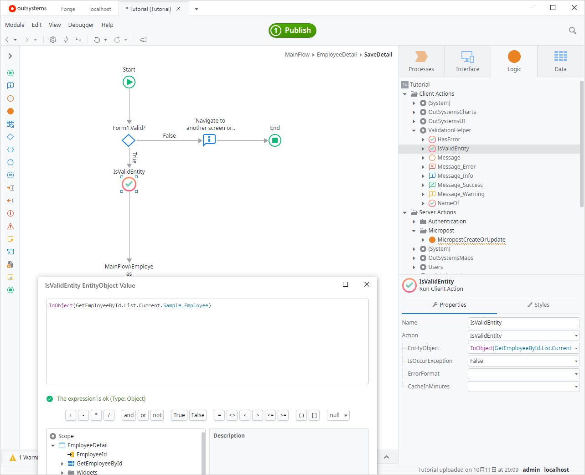

# Tutorial

Hello, Thank you for opening this page.  
This tutorial will show you how to use "ValidationHelper" through the simplest use case.

---

There are two things to do.

1. Define validation rules in this app.
2. Call validation action where you want to verify.

For example, in a module called "OutSystemsSampleDataDB" there is an entity called "Sample_Employee". This entity has attributes such as "FirstName", "LastName", and "Email". In this tutorial, we will define validation rules for this entity and call the validation action to see how the validation is performed. 

Do you have "OutSystemsSampleDataDB" in your environment? If not, install it from [Forge]((https://www.outsystems.com/forge/component-overview/4145/outsystems-sample-data)).

Are you ready? Let's get started.

{: loading=lazy }

## 1. Define validation rules in this app

First of all, open the ValidationHelper app (https://<YOUR_SERVER\>/ValidationHelper/).  
Then, the entity search screen is displayed, so search for the entity for which you want to define validation rules.

In this case, we want to define a validation rule for the "Sample_Employee" entity, so we search for "Sample_Employee" and click on it.

{: loading=lazy }

Once the detail screen opens, define the following validation rules

1. `FirstName` and `LastName` must be at least 2 characters
2. `Email` must be in the regular expression format `[a-zA-Z0-9.]@mydomain.com`.

The validation rule definition is complete when you click the Save button with the settings as shown in the following image.

{: loading=lazy }
{: loading=lazy }

## 2. Call validation action where you want to verify

Start Service Studio and create a tutorial app and open the module.
Then add references to "Sample_Employee" and "ValidationHelper" to your app.

{: loading=lazy }
{: loading=lazy }

Next, create a screen using ServiceStudio's scaffolding function. The screen is slightly customized with only four input fields: FirstName, LastName, BirthDate, and Email.

{: loading=lazy }

Next, add validation to the save button process. The `SaveDetail` action before adding the process looks like this

{: loading=lazy }

Since there is a built-in validation, add an `IsValidEntity` action next to it.  The `IsValidEntity` action takes an entity object and validates it according to the rules you just set.

Set the input parameters as follows

- EntityObject: `ToObject(GetEmployeeById.List.Current.Sample_Employee)`
- IsOccurException: False

{: loading=lazy }

The `IsValidEntity` action has the following outputs

- IsValid: True if all validations pass, False otherwise
- ErrorList
  - AttrName: The name of the item that did not pass the validation.
  - MessageName: Error message

Then, add a process to determine if there are any errors and save the data if there are no errors. 
If an error occurs, set the `WidgetName.IsValid` and `WidgetName.ErrorMessage` values to the widget on each screen as follows.

```js
Input_FirstName.Valid
  = HasError(IsValidEntity.ErrorList, "FirstName").IsValid
Input_FirstName.ValidationMessage
  = HasError(IsValidEntity.ErrorList, "FirstName").ErrorMessage
```

The `HasError` action used here is a convenience for retrieving error messages for any attribute from the `ErrorList`.

{: loading=lazy }

That's all for how to use it.  
Let's check the execution result.

## Execution Result

Open the screen you just created in your browser and browse to the appropriate employee. Then, to see how the validation works, change FirstName and LastName to just one character and click the Save button.

{: loading=lazy }

The following error message is displayed to confirm that the validation is working as defined.

{: loading=lazy }

Change the condition to one that does not result in an error and press the Save button. The error message is resolved and the file is saved correctly.

{: loading=lazy }

---

That's all for the tutorial.  
While this tutorial has covered validation of the length of the input string and formatting using regular expressions, there are other validations that can be used. See [Reference](/Reference) for more information.
